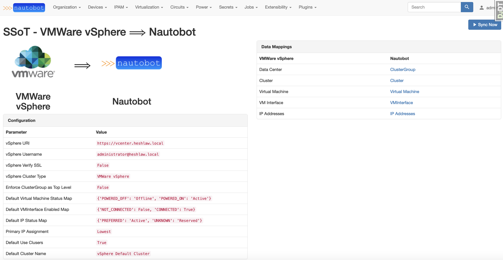
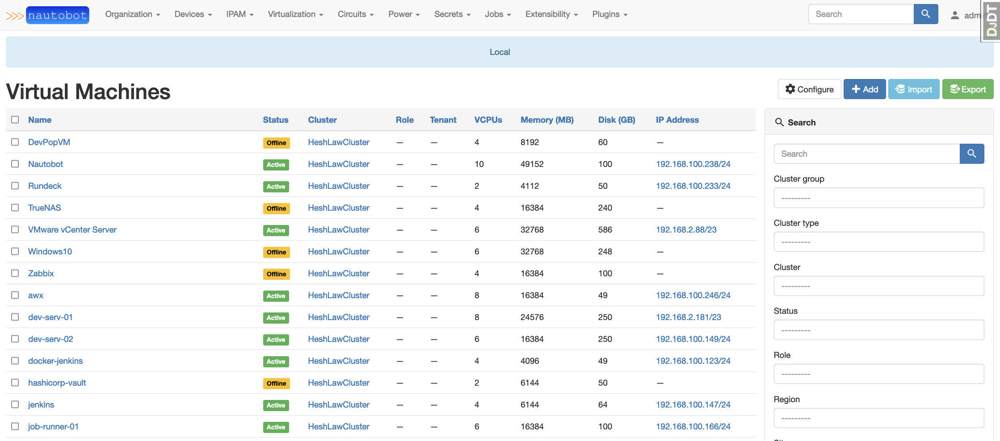

# Nautobot SSoT vSphere

A plugin for [Nautobot](https://github.com/nautobot/nautobot) that leverages the SSoT plugin to create Virtual Machines, VMInterfaces, IPAddresses, Clusters, and Cluster Groups from VMWare vSphere.




## The future of Virtual Machine In Nautobot

There is discussion in place to that will bring big changes to VirtualMachine and VMInterface targeted for release 2.0.
See the [issue](https://github.com/nautobot/nautobot/issues/1178)

When that time comes, this application will need to be updated to handle the new core model structure

## Installation

The plugin is available as a Python package in pypi and can be installed with pip

```shell
pip install nautobot-ssot-vsphere
```

> The plugin is compatible with Nautobot 1.2.0 and higher

To ensure Nautobot SSoT vSphere is automatically re-installed during future upgrades, create a file named `local_requirements.txt` (if not already existing) in the Nautobot root directory (alongside `requirements.txt`) and list the `nautobot-ssot-vsphere` package:

```no-highlight
# echo nautobot-ssot-vsphere >> local_requirements.txt
```

Once installed, the plugin needs to be enabled in your `nautobot_config.py`

```python
# In your nautobot_config.py
PLUGINS = ["nautobot_ssot_vsphere"]

PLUGINS_CONFIG = {
    "nautobot_ssot_vsphere": {
        "VSPHERE_URI": os.getenv("VSPHERE_URI"),
        "VSPHERE_USERNAME": os.getenv("VSPHERE_USERNAME"),
        "VSPHERE_PASSWORD": os.getenv("VSPHERE_PASSWORD"),
        "VSPHERE_VERIFY_SSL": is_truthy(os.getenv("VSPHERE_VERIFY_SSL", False)),
    },
}
```

The plugin behavior can be controlled with additional configuration settings

```bash
- `VSPHERE_TYPE` Defaults to `VMWare vSphere`
- `ENFORCE_CLUSTER_GROUP_TOP_LEVEL` Defaults to True
- `VSPHERE_VM_STATUS_MAP` Defaults to {"POWERED_OFF": "Offline", "POWERED_ON": "Active"}
- `VSPHERE_IP_STATUS_MAP` Defaults to {"PREFERRED": "Active", "UNKNOWN": "Reserved"}
- `VSPHERE_VM_INTERFACE_MAP` Defaults to {"NOT_CONNECTED": False, "CONNECTED": True}
- `PRIMARY_IP_SORT_BY` Defaults to "Lowest"
- `DEFAULT_USE_CLUSTERS` Defaults to `True`
- `DEFAULT_CLUSTER_NAME` Defaults to "vSphere Default Cluster"
```

To get a detailed description on each configuration setting, head over to the [Overview](https://h4ndzdatm0ld.github.io/nautobot-ssot-vsphere/overview.html) documentation.
